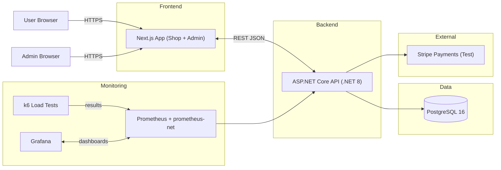

# Project Report

## 1. Project Overview

**Project Name**: FreshMart - E-commerce platform

**Group Members**:

- 292944, Omar, ohassane100
- 292837, Yahya, yahya2491
- 292833, Dunia Aljafare, DuniaAljafare

**Brief Description**:
FreshMart is a full-stack e-commerce web application. The Next.js frontend provides a product catalog and shopping experience. The ASP.NET Core backend (net8.0) exposes REST endpoints for products, carts, users and payments backed by PostgreSQL. Observability and load testing are integrated via Prometheus, Grafana, and k6.

## 2. Design Summary

### 2.1 Problem Statement

For the past 100 years, grocery shopping has been dominantly done physically, in the modern age, many different shopping experiences in a wide variety of fields have been digitalized. However, grocery shopping remains primarily physical, despite the fact that many adults are busy and do not have the time to physically visit grocery shops in person.
We aim to create a simple user-friendly user application that simulates an online grocery shopping experience. The application will allow product browsing from a wide list of product. This application aims to digitalize grocery shopping in a simple web interface for users to interact and use.

### 2.2 Target Users / Personas

The target users of this application are any individuals who are looking to save time in their busy day-to-day lives. This includes individuals such as professionals, parents, and elderly individuals who are unable to physically visit the store. This application aims to provide a simple and convenient way for people to grocery shop digitally while saving their time.

### 2.3 Primary Objectives

- Provide a user-friendly web interface that simulates a grocery shopping experience.
- Allow users to browse and add products to their cart.
- Allow admins to add, update, and delete products through API key protected admin endpoints (current backend guard) while we work toward richer admin auth.
- Allow admins to manage and track website traffic through Grafana.
- Provide the ability to create user accounts for regular users.
- Each user account contains a personal exclusive page that shows user information.
- Implement machine-learning powered product categorization to keep the catalog organized and bootstrap future recommendation work.

### 2.4 Non-goals

- Processing real payments with real money (Stripe will be used in test/sandbox mode only for simulation with fake money).
- Advanced security features like MFA and OAuth2 social login (basic password checks and password hashing will only be implemented).

### 2.5 Key Features

- Basic user authentication (sign-up/login with hashed passwords).
- Product browsing with automatic category suggestions and per-product analytics counters.
- Cart page that shows products currently in the cart.
- A wide product catalog with at least 20 products.
- A dummy checkout process for product purchase simulation.
- Admin interface that can manage products (add, update, delete) and track website traffic to see site metrics.

## 3. Architecture Overview

### 3.1 High-Level Architecture

The system is a typical client-server web application:



### 3.2 Components

- **Frontend** (`frontend/`): Next.js 15 application (React 19). Development and production modes supported; `NEXT_PUBLIC_API_URL` points to the API.
- **Backend** (`backend/Ecommerce.Api/`): ASP.NET Core Web API (net8.0). Uses EF Core with Npgsql for Postgres, exposes `/metrics`, and integrates with Stripe for payments.
- **Database**: Postgres 16 (in `infra/docker-compose.yml`) with persistent volume and Adminer UI.
- **Monitoring & Perf**: Prometheus, Grafana, and k6 are configured in `infra/docker-compose.yml` for local testing and dashboards.

### 3.3 Technologies Used

- Backend: .NET 8.0, Entity Framework Core, Npgsql
- Frontend: Next.js 15, React 19
- Database: PostgreSQL 16
- Observability: prometheus-net (API), Prometheus, Grafana
- Load testing: k6
- Container tooling: Docker Compose

## 4. Design Architecture

### 4.1 Frontend (Next.js)

Public shop, admin portal (`/admin`), monitoring page (via Grafana). The admin UI attaches the `X-Admin-Key` header expected by the backend for privileged operations.

### 4.2 Backend (C# .NET 8, ASP.NET Core)

Stateless REST API (catalog, carts, user auth, admin CRUD, payments), Stripe PaymentIntent flow (sandbox mode), metrics exposed via `/metrics` (prometheus-net middleware). Controllers: `Products`, `Cart`, `User`, `Admin`, `Payments`, `Health`. Admin endpoints are guarded by an `AdminKey` filter that checks the configured access key.

### 4.3 PostgreSQL

Source of truth (users, products, carts/cart items). Entity Framework Core handles schema (migrations are checked in) and supports retry/offline modes. The API can optionally run against the EF in-memory provider (`UseInMemory`) for tests or demos.

### 4.4 Prometheus + Grafana (+ k6)

We collect API metrics and k6 load test results in Prometheus, and visualize them in Grafana dashboards. The admin can access the Grafana panels to see system health.

### 4.5 prod

- We use automated CI/CD via GitHub Actions to build, test, and deploy Docker images to Docker Hub.
- We then use the Docker Hub images to deploy containers on OpenStack VMs.

### 4.6 Testing

- Unit tests are run on the backend.
- We conduct performance testing using k6 scripts that simulate load on the API and export metrics to Prometheus for analysis.
- We test the ML and Stripe integration using health checks.

### 4.7 ML Integration

- ML integration via Microsoft.ML for product categorization.
- If products have not been categorized when created then the ML will automatically sort the product by category.

## 5. Prerequisites

### 5.1 System Requirements

- OS: Linux/macOS/Windows (Docker recommended)
- RAM: 8GB+ recommended
- Disk: 2GB+ free (more for DB/containers)

### 5.2 Required Software

- Docker Engine (v24+) with Compose plugin
- Optional for local dev: .NET 8.0 SDK, Next.js 20+ and npm

### 5.3 Dependencies (high-level)

- Backend NuGet packages (declared in `Ecommerce.Api.csproj`): Npgsql.EntityFrameworkCore.PostgreSQL, Microsoft.EntityFrameworkCore.InMemory (tests), Stripe.net, prometheus-net.AspNetCore, Swashbuckle.AspNetCore, FluentValidation, BCrypt.Net-Next, Bogus, Scrutor, Microsoft.ML.
- Frontend npm packages: next@15.5.4, react@19.1.0, react-dom@19.1.0, next-auth.
- Docker images used in Compose: postgres:16, adminer, prom/prometheus, grafana/grafana, grafana/k6.

How to install/restore these dependencies (if running locally without Docker):

- Backend (NuGet):

```bash
dotnet restore backend/Ecommerce.Api/Ecommerce.Api.csproj
dotnet restore backend/Ecommerce.Tests/Ecommerce.Tests.csproj
```

- Frontend (npm):

```bash
cd frontend
npm install
```

- Docker images (optional pre-pull/build; otherwise handled by the up command):

```bash
cd infra
docker compose pull    # pulls postgres, adminer, prometheus, grafana, k6
docker compose build   # builds API and frontend images
```

- Stripe CLI (optional, for webhook testing): install via your OS package manager, then verify with:

```bash
stripe --version
```

## 6. Build Instructions

### 6.1 Clone repository

```bash
git clone https://github.com/dat515-2025/Group-14.git
cd Group-14
```

### 6.2 Install Dependencies

Because all runtime dependencies (Postgres, API, frontend, Prometheus, Grafana, k6) are containerized, you only need a working Docker installation with the Compose plugin. No local installation of .NET, Node.js, or Postgres is required unless you plan to run services outside Docker.

Required:

```bash
docker --version
docker compose version
```

If these commands return versions (e.g. Docker Engine 24.x and Docker Compose v2.x), you can proceed directly to step 3.

Optional (only for manual local development without Docker):

```bash
dotnet --version   # Should be 8.0.x
node --version     # Should be >= 20
npm --version      # Comes with Node
```

No further dependency installation is needed for the default workflow.

When developing outside Docker, application-level packages are restored automatically:

- Backend NuGet packages (from `backend/Ecommerce.Api/Ecommerce.Api.csproj`): EF Core, Npgsql provider, Stripe.net, prometheus-net.AspNetCore, Swashbuckle, FluentValidation, BCrypt.Net-Next, Bogus, Scrutor, Microsoft.ML. Run `dotnet restore` to fetch them.
- Frontend npm packages (from `frontend/package.json`): next, react, react-dom, next-auth. Run `npm install` in `frontend/`.

Optional tooling:

```bash
stripe --version   # Stripe CLI (for testing webhooks & keys) - optional
```

Stripe CLI is only needed if you intend to simulate or forward webhook events locally; regular API usage inside Docker works with environment keys alone.

Full local development dependency list (outside Docker):

System tools:
- .NET SDK 8.0.x
- Node.js 20.x (with npm 10.x)
- PostgreSQL 16 (optional if you want a local DB instead of the Postgres container)
- Git (for source control)

Recommended global dotnet tools (optional):
```bash
dotnet tool install --global dotnet-ef
```

Backend NuGet packages (with versions):
```text
Npgsql.EntityFrameworkCore.PostgreSQL 9.0.4
Microsoft.EntityFrameworkCore.InMemory 9.0.9
Stripe.net 49.0.0
prometheus-net.AspNetCore 8.2.1
Swashbuckle.AspNetCore 9.0.6
FluentValidation.AspNetCore 11.3.1
BCrypt.Net-Next 4.0.3
Bogus 35.6.4
Scrutor 6.1.0
Microsoft.ML 4.0.3
Microsoft.AspNetCore.OpenApi 8.0.20
Microsoft.EntityFrameworkCore.Design 9.0.9 (design-time; PrivateAssets=all)
```

Restore them with:
```bash
dotnet restore backend/Ecommerce.Api/Ecommerce.Api.csproj
dotnet restore backend/Ecommerce.Tests/Ecommerce.Tests.csproj
```

Frontend npm packages (with versions):
```text
next 15.5.4
react 19.1.0
react-dom 19.1.0
next-auth 4.24.11
```

Install them with:
```bash
cd frontend
npm install
```

### 6.3 Build the Application

Build and start all services (API, frontend, Postgres, Prometheus, Grafana, k6):

```bash
cd infra && docker compose up --build -d
```

Key hosts/ports once up:

- API: <http://localhost:8080>
- Frontend: <http://localhost:3000>
- Adminer: <http://localhost:8081>
- Prometheus: <http://localhost:9090>
- Grafana: <http://localhost:3001>

Key log in details:
- Grafana default login: `admin` / `admin`.
- On the frontend, the Admin login details are: `admin` / `admin`.
- On the frontend, the User login details are: `alice` / `user`.


When done running, stop services:

```bash
cd infra && docker compose down -v
```

### 6.4 Configuration

Environment variables and configuration files are defined in `infra/docker-compose.yml` for each service. No additional configuration is needed for local development.

## 7. Design Deployment

### 7.1 Deployment Strategy

We will deploy our application using docker images to ensure consistency across different environments. To do this, we will create images for both the frontend (Next.js) and the backend (C# .NET) and store them on Docker Hub which will then be deployed via Kubernetes running on a OpenStack VM.

### 7.2 Continuous Integration / Continuous Deployment (CI/CD)

Throughout the development of this project, we will use **GitHub Actions** to continuously integrate and deploy our code to a web server. This will ensure that our code is constantly tested to ensure that it is functional before deployment. Additionally, this will allow us to easily deploy new changes to our web application.
Each push to the repository will trigger:
- Unit and integration tests in the Backend.
- Automated build of the Docker image
- Automated deployment of the docker image to the web server
This ensures that are constantly tested and checked before automated deployment.

### 7.3 Scalability

The application will be deployed on Kubernetes, which will provide build in support for scaling the app. The scalability will be managed in two primary ways:

Horizontal scaling:
Kuberetes will have the ability to automatically add or remove application pods based on real time user demand. This will improve system feedback during peek usages and will help maintain efficient resource utilization.

Vertical scaling:
The resource limits and requests for each container can be manually adjusted, which results in different services having more allocated CPU or memory based on necessity. 

## 8. Deployment Instructions

### 8.1 Local Deployment

```bash
cd infra && docker compose up --build -d #Build and starts all services
```

### 8.2 Cloud Deployment

The system was established on UiS OpenStack utilizing a 3-node Kubernetes cluster running Talos Linux.
This cluster is composed of 1 control-plane node (master) and 2 worker nodes that manage all application workloads (Postgres, API, Frontend, and Prometheus). Talos offers a minimalist, secure, and Kubernetes-focused operating system, and all containers are orchestrated through Kubernetes.

```bash
# 1.Create project namespace (ecommerce)
kubectl apply -f namespace.yaml
# 2.Deplying Postgres Database
kubectl apply -f secret-db.yaml
kubectl apply -f configmap.yaml
kubectl apply -f postgres-statefulset.yaml
kubectl apply -f postgres-service.yaml
# 3.Deploying Backend
kubectl apply -f api-deployment.yaml
kubectl apply -f api-service.yaml
# 4.Deploying Frontend
kubectl apply -f frontend-deployment.yaml
kubectl apply -f frontend-service.yaml
# 5.Deploying Prometheus
kubectl apply -f prometheus-configmap.yaml
kubectl apply -f prometheus-deployment.yaml
kubectl apply -f prometheus-service.yaml
# 6.Restarting Frontend & Backend After Code Changes
git push #CI/CD github action automatically builds a new docker image and pushes it to dockerhub
kubectl rollout restart deployment ecommerce-api -n ecommerce #pulls latest dockerhub Image
kubectl rollout restart deployment ecommerce-frontend -n ecommerce #pulls latest dockerhub Image
# 7. Accessing Services Externally
Frontend:  http://172.16.2.57:32601
Grafana:   http://172.16.2.57:32001
Prometheus: http://172.16.2.57:32002
# 8.General Kubernetes Checks
kubectl get pods -n ecommerce
kubectl get svc -n ecommerce
kubectl get deployments -n ecommerce
kubectl logs <specific pod name> -n ecommerce
kubectl describe pod <specific pod name> -n ecommerce
```

### 8.3 Verification

```bash
# Kubernetes Checks To Verify Deployment Worked
kubectl get pods -n ecommerce
kubectl get svc -n ecommerce
kubectl get deployments -n ecommerce
kubectl logs <specific pod name> -n ecommerce
kubectl describe pod <specific pod name> -n ecommerce
# Example health check endpoints
curl -s http://localhost:8080/healthz #check Stripe integration and database connection
curl -s http://localhost:8080/api/products #check products
curl -s http://localhost:8080/api/user #check users
curl -s http://localhost:8080/metrics | head -n 20 #check metrics
```

## 9. Testing Instructions

### 9.1 Unit Tests

Run backend unit tests:

```bash
dotnet test backend/Ecommerce.Tests/Ecommerce.Tests.csproj
```

### 9.2 Integration Tests

- The repo includes a `perf/` folder with k6 scripts. Docker Compose runs a basic k6 test. To run k6 manually (when Compose is up):

```bash
docker compose -f infra/docker-compose.yml run --rm k6
```

### 9.3 Performance Tests

Where to run

From the repository root (`assignments`) on your machine. Ensure Docker and Docker Compose (v2) are installed and running.

What this shows

- `perf/basic-load-test.js` is a small k6 scenario that exercises API endpoints (products, users, carts).
- `perf/run-load-test.sh` starts required services via `infra/docker-compose.yml` and runs the k6 test.

How to run

1. Start infra services (separate terminal):

```bash
cd infra && docker compose up --build -d
```

2. Run the load test (make helper executable if needed):

```bash
chmod +x perf/run-load-test.sh
K6_VUS=20 K6_DURATION=2m perf/run-load-test.sh
```

## 10. Usage Examples

### 10.1 Basic API calls

Get all users:

```bash
curl --location 'http://localhost:8080/api/admin/users' \
--header 'x-admin-key: 123-admin-key'
```
Get product list:

```bash
curl --location 'http://localhost:8080/api/products'
```

Health and metrics:

```bash
curl --location 'http://localhost:8080/healthz'
curl --location 'http://localhost:8080/metrics' | head -n 40
```

### 10.2 Advanced Features

- Payments: Stripe integration present (requires Stripe API keys set in environment for payment flows and the Stripe health check).
- Metrics: API exposes Prometheus metrics via prometheus-net.
- Advanced product recommendations: Recommends products from the same category, the products are categorized using Microsoft.ML library (A machine learning model).

## 11. Presentation Video

- Press [here](https://youtu.be/Az8PcRBFHIo) to watch the presentation video. The length is 9 minutes and 54 seconds.
- Here is the full in the case the link above doesnt work: https://youtu.be/Az8PcRBFHIo

## 12. Troubleshooting

### 12.1 Common Issues

1. API cannot connect to Postgres

Symptoms: API fails to start or `/healthz` shows DB errors.

Fix:

```bash
docker compose -f infra/docker-compose.yml logs postgres
docker compose -f infra/docker-compose.yml ps
# Ensure the ConnectionStrings__DefaultConnection env points to the DB host used by the service
```

2. Prometheus/Grafana show no data

Fix: Open Prometheus `http://localhost:9090/targets` and confirm the API target is UP and scraping `http://api:8080/metrics`.

3. k6 exits early

Fix: Inspect `docker compose -f infra/docker-compose.yml logs k6`, ensure the API reached healthy `/healthz` before k6 started, and re-run if necessary.

4. Ports already in use
```
Error response from daemon: Ports are not available: exposing port TCP 0.0.0.0:8080 -> 0.0.0.0:0: listen tcp 0.0.0.0:8080: bind: address already in use
```

If you get the error above when starting the Docker Compose services, it means that one or more of the ports required by the services are already in use on your machine.

To view what is using the port simply run the following command in your terminal:

```bash
sudo lsof -i:8080
```

To terminate all processes using that port, run:

```bash
sudo kill -9 $(sudo lsof -t -i:8080)
```

### 12.2 Summary of Debug commands

```bash
docker compose -f infra/docker-compose.yml ps
docker compose -f infra/docker-compose.yml logs -f api
docker compose -f infra/docker-compose.yml logs -f postgres
sudo lsof -i:8080
```

## 13. Progress Table

| Task/Component                                                      | Assigned To | Status        | Time Spent | Difficulty | Notes       |
| ------------------------------------------------------------------- | ----------- | ------------- | ---------- | ---------- | ----------- |
| Project Setup & Repository                                          | Omar        | ✅ Complete    | 2h         | Medium     | Repo initialized and design doc pushed (2a09ce2). |
| [Design Document](https://github.com/dat515-2025/group-name)         | Omar, Dunia, Yahya | ✅ Complete    | 16h        | Easy       | Draft + revisions across team (Omar 10h; Dunia 3h; Yahya 3h). |
| [Backend API Development](https://github.com/dat515-2025/group-name) | Omar, Yahya | ✅ Complete    |   67h        | Hard       | Prototype, Stripe, error handling, health checks, ML. |
| [Database Setup & Models](https://github.com/dat515-2025/group-name) | Omar, Yahya       | ✅ Complete    |    14h        | Medium     | EF Core models and realistic seed data. |
| [Frontend Development](https://github.com/dat515-2025/group-name)    | Dunia       | ✅ Complete    | 42h        | Medium     | Skeleton, full integration, checkout/admin features; merge fixes. |
| [Docker Configuration](https://github.com/dat515-2025/group-name)    |  Yahya          | ✅ Complete    |    14h        | Easy       | Docker Compose for API/Frontend/Postgres/Prometheus/Grafana/k6. |
| [Cloud Deployment](https://github.com/dat515-2025/group-name)        | Yahya       | ✅ Complete    |      53h      | Hard       | UiS OpenStack Talos K8s cluster; services deployed and rolled out. |
| [Testing Implementation](https://github.com/dat515-2025/group-name)  | Omar        | ✅ Complete    | 8h           | Medium     | Unit tests (products/categories) + k6 load and Grafana dashboards. |
| [Documentation](https://github.com/dat515-2025/group-name)           | Omar        | ✅ Complete    | 13h         | Easy       | Report updates and finalization. |
| [Presentation Video](https://github.com/dat515-2025/group-name)      | Omar, Yahya, Dunia        | ✅ Complete    | 4h         | Medium     | Recorded demo/presentation video (13-11). |

**Legend**: ✅ Complete | 🔄 In Progress | ⏳ Pending | ❌ Not Started

## 14. Hour Sheet

### 14.1 Omar

| Date        | Activity                                                                                                                                       | Hours | Description |
|-------------|------------------------------------------------------------------------------------------------------------------------------------------------|------:|-------------|
| 18-09-2025  | Worked on design document together                  |     3 |  Collaboration with team members to outline project goals and requirements.           |
| 25-09-2025  | [Pushed design document onto github and made minor adjustments](https://github.com/dat515-2025/Group-14/commit/2a09ce23e33ab4a816a5028d7467f9e29142f0b7)                                                                                      |     2 | Adjusted design document and pushed the update version onto github (also set up the repo)          |
| 01-10-2025  | [Adjusted design document based on changes to the requirements](https://github.com/dat515-2025/Group-14/commit/03caada49bbade9d70a6421b5e854a64508fa4cd)                                                                                                                           |     2 | Revised the design document to reflect updated requirements; clarified scope and updated affected sections. |
| 03-10-2025  | Planned the project timeline with the group                                                                                                                           |     2 | Created shared milestones, deliverables, and deadlines; aligned responsibilities across the team. |
| 04-10-2025  | Planned the backend with a class diagram                                                                                                       |     1 | Produced an initial domain model/class diagram covering Users, Admins, Products, Orders, and relationships. |
| 09-10-2025  | [Drafted basic requests](https://github.com/dat515-2025/Group-14/commit/45903a015f6ba0bb8d1bd768cfa72ae1e285906e)                                                                                              |     2 | Outlined core REST endpoints with request/response shapes and scaffolded controller placeholders. |
| 11-10-2025  | [Implemented basic prototype of the system (Added Users, Admins, Products etc.)](https://github.com/dat515-2025/Group-14/commit/9200361a0c97220709d12981231c2d034a994d39)                                                                 |     3 | Implemented initial models and CRUD endpoints for users/admins/products; verified basic flows. |
| 14-10-2025  | [Updated and made all the requests fit our initial description of them; tested all requests to ensure they are functional](https://github.com/dat515-2025/Group-14/commit/dbdd4ae1ed9161a0823de846879bec757ec69d0b)                       |     3 | Aligned API contracts with the spec and exercised endpoints end‑to‑end to confirm functionality. |
| 15-10-2025  | [Finished integrating Stripe (Payment controllers), fully functional and connects directly to the Stripe API](https://github.com/dat515-2025/Group-14/commit/b9d5b75196e0af5a9aedca6c92fcf6e34271ffdc)                                    |     2 | Added payment controllers using Stripe.NET in test mode and validated a full checkout flow. |
| 17-10-2025  | [Attempted to merge backend work with yahya, was not a successfull or complete merge](https://github.com/dat515-2025/Group-14/commit/0647ecd58a589b15e3b4aa9c6620125c1ca5d9c9)                                                                |     3 | Attempted branch merge with conflict resolution; identified blockers to complete integration. |
| 18-10-2025  | [Worked on merging the backend (with my teammate yahya); we also planned project future; discussed checklist; planned next TA meeting; filled the file](https://github.com/dat515-2025/Group-14/commit/282d2af164222a775b791719d3577afa26a1dcd2)                           |     4 | Continued merge effort, updated checklist, prepared talking points for TA meeting, and documented outcomes. |
| 25-10-2025  | [Created unit tests and added categories to products](https://github.com/dat515-2025/Group-14/commit/c4cc746dc35ed60859d19fd1a912dbaed19462b7)                                                                                            |     4 | Introduced product categories and wrote unit tests covering categorization and validations. |
| 02-11-2025  | [Added robust error handling, improved logging](https://github.com/dat515-2025/Group-14/commit/c7a1b98e28a22dbb51bf99f5434b62016afd7cb0)                                                                                   |     5 | Implemented centralized exception handling and structured logging; standardized error responses. |
| 02-11-2025  | [Added health checks to the API](https://github.com/dat515-2025/Group-14/commit/c16870dcef3622f827d0ed43dfebca29434adeb9)                                                                                      |     1 | Added a /healthz endpoint and wired basic readiness checks (e.g., database, external services). |
| 05-11-2025  | [Added ML integration and attempted to get performance testing with visual feedback via Grafana to work](https://github.com/dat515-2025/Group-14/commit/259ad42de5ff8c956b95f8b60977f4f5640dc53e)                                                                  |     5 | Integrated ML-driven product categorization/recommendations and set up Prometheus/Grafana; ran initial k6 tests. |
| 05-11-2025  | [Attempted to get performance tests to work](https://github.com/dat515-2025/Group-14/commit/259ad42de5ff8c956b95f8b60977f4f5640dc53e)                                                                  |     1 | Created non functional performance tests. |
| 05-11-2025  | [Fixed an issue with the performance testing and ensured it worked via Grafana](https://github.com/dat515-2025/Group-14/commit/0eda0a803b8be85882a7f0ac6305e8be7e578923)                                                                  |     3 | Resolved k6 → Prometheus export problems and confirmed metrics rendering correctly in Grafana. |
| 08-11-2025  | [Added more seeding data](https://github.com/dat515-2025/Group-14/commit/b95b2322a54e19dbab0629f3070ec1ea41205f07)                                                                                               |     1 | Expanded database seed with realistic users/products for testing and demos. |
| 08-11-2025  | [Merging all the work together after fixing seeding data, we all were together in person while merging the project](https://github.com/dat515-2025/Group-14/commit/b84b73b1402d5048a89c738de2aa9d64cbd08b91)                                                                                               |     5 | In‑person merge session to reconcile frontend/backend changes and validate end‑to‑end flows. |
| 08-11-2025  | [Cleaned backend](https://github.com/dat515-2025/Group-14/commit/cb6ff5145c9894d48849439b4f6a34435c5f5687)                                                                                               |     1 | Performed backend cleanup: removed dead code, organized folders, and standardized naming. |
| 08-11-2025  | [Updated design document based on our final version of the prooject](https://github.com/dat515-2025/Group-14/commit/b6eaed0bead49d1db46a66593edec6ea8d2e536f)                                                                                               |     2 | Updated the design doc to reflect the final implemented architecture and flows. |
| 10-11-2025  | [We continued the merging from last time, there were errors in the frontend that showed up after both backends were merged](https://github.com/dat515-2025/Group-14/commit/d0bdfe650d2aaa263d4681ab56bb5a0a9bf0a099)                                                                                              |    7 | Debugged frontend regressions post‑merge; aligned API schemas and fixed integration issues. |
| 10-11-2025  | [Update the report](https://github.com/dat515-2025/Group-14/commit/ca868d92f40b16fe2c866e0ae5d94e1ae2ebbc87)                                                                                              |    3 | Expanded the report (architecture, build/run, testing, usage) and polished documentation. |
| 11-11-2025  | [Finalized the merge and tested its deployment](https://github.com/dat515-2025/Group-14/commit/c1d2ac52d02e60b6bbda098b35c3c429cf81bca6)                                                                                              |     2 | Completed the merge and validated local deployment via Docker Compose; smoke‑tested key endpoints. |
| 13-11-2025  | [Worked on this report, recorded project video](https://github.com/dat515-2025/Group-14/commit/54ad5c4bf826371c0fbb511cbeeca0838653e431)                                                                                              |     4 | Finalized report content and recorded the demo/presentation video. |
| 13-11-2025  | [Worked on checklist](https://github.com/dat515-2025/Group-14/commit/0191753037fdd2e9bf9028b84b2fe6ab55086bc0)                                                                                              |     3 | Worked on checklist updates and ensured all items I worked on were addressed. |
| 13-11-2025  | [Final changes to the report, checklist, and commit history](https://github.com/dat515-2025/Group-14/commit/bb21f8cf75b93d80dd094f1e921bde29c15ed557)                                                                                              |     6 | Worked on merging commit history, finalizing the report, ensuring everything worked. |
| **Total**   |                                                                                                                                                | **80** |             |

### 14.2 Yahya

| Date        | Activity                                                                                                              | Hours | Description |
|-------------|-----------------------------------------------------------------------------------------------------------------------|------:|-------------|
| 15-08-2025  | Implimented Docker for the backend and added it to Docker-Compose file so it runs Posgres, Graphana and Promethus in docker containers | 4 |             |
| 18-09-2025  | Worked on design document together                                                                                   |     3 |             |
| 03-10-2025  | Planned the project                                                                                                   |     2 |             |
| 04-10-2025  | Planned the backend with a class diagram                                                                              |     1 |             |
| 08-10-2025  | [Built a backend skeleton](https://github.com/dat515-2025/Group-14/commit/9731b096f9c6ea183e5f85f163b523e94ca22f92)                                                                                              |     2 |             |
| 12-10-2025  | [Implemented Cart Pipeline](https://github.com/dat515-2025/Group-14/commit/f238cca12d724c6256e843bf8c6802197470e3f4)                            |     2 |             |
| 18-10-2025  | [Worked on merging the backend (with my teammate omar); we also planned project future; discussed checklist; planned next TA meeting; filled the file](https://github.com/dat515-2025/Group-14/commit/282d2af164222a775b791719d3577afa26a1dcd2)  |     4 |             |
| 20-10-2025  | [frontend/backend Fixed a problem where the browser wasnt able to access backend ports from frontend to Program.cs](https://github.com/dat515-2025/Group-14/commit/a9372b6ada48c7ae71090624a943bbe444026218) | 2 |             |
| 21-10-2025  | [Created a frontend dockerfile that is added to the docker-compose file and now the whole project can be run as containers from a singular docker compose file.](https://github.com/dat515-2025/Group-14/commit/0392a9882870d6885b406eddb3d91d0ae3665df7) | 2 |             |
| 22-10-2025  | [Created seperate images from the project and uploaded them to dockerhub, then add github action that updates the images on dockerhub eveytime i push on my branch, so they're always upto date.](https://github.com/dat515-2025/Group-14/commit/06b1b34af23fd18a9f88d674ef8c0c2fbd8ddf81) | 6 |             |
| 27-10-2025  | Open Stack setup in terms of machines k8s and open ports and floating IP | 6 |             |
| 28-10-2025  | deploying the Postgres database but encountered configuration issues. | 10 |             |
| 29-10-2025  | Worked with jayachandler on fixing presistant storge problem, not succeful and he told me to work stateless for now | 1 |             |
| 29-10-2025  | Backend API deployment on openstack | 8 |             |
| 30-10-2025  | Frontend deployment on openstack   |     7 |             |
| 7-11-2025  | Postgres and grafana deployment on openstack           |     3 |             |
| 08-11-2025  | Merging all the work together (and deploying it)                                                                      |     8 |             |
| 10-11-2025  | Merging all the work together (and deploying it)                                                                      |    10 |             |
| **Total**   |                                                                                                                       | **81** |             |

### 14.3 Dunia

| Date         | Activity                                  | Hours | Description |
|--------------|-------------------------------------------|------:|-------------|
| 18-09-2025   | Worked on design document together        |     3 |             |
| 03-10-2025   | Planned the project                        |     2 |             |
| 08-10-2025   | [Built a frontend skeleton](https://github.com/dat515-2025/Group-14/commit/f682c96a3f540fdc68580b8c76dbe64c178319b7)                 |     4 |             |
| 18/26-10-2025| [Full frontend/backend integration](https://github.com/dat515-2025/Group-14/commit/dd219985534ac33ca63e1e66c09f2ccd65f70cef)          |    10 |             |
| 02-11-2025   |[Implemented checkout improvements, admin user & product management, login/signup enhancements, and product recommendations](https://github.com/dat515-2025/Group-14/commit/f7495639ee803493cd37f85cda1d066a048c4fca) | 4| 
| 3-11-2025    | [Final checkout implementation](https://github.com/dat515-2025/Group-14/commit/60f97c2d0d14b9e62b129dd41dfd53a21f1ce1bf) | 6|
| 08-11-2025   | Merging all the work together (and deploying it) |     8 |       |
| 10-11-2025   | Merging all the work together (and deploying it) |    10 |       |
| 13-11-2025   | Video Recording and Report Work                  | 4 |           |
| **Total**    |                                           | **51** |             |

### 14.4 Group Total: 212 hours

---

## 15. Final Reflection

### 15.1 Omar - Reflection

My primary role in this project was backend development using ASP.NET Core, where I focused on building a RESTful API, integrating Stripe for Payments, implementing health checks, adding unit and performance tests, updating documentation, and ML integration for product categorization.

**What I Learned:**
- Deepened my understanding of ASP.NET Core Web API development, including routing, controllers, and middleware.
- Gained hands-on experience with Stripe API integration for handling payments.
- Improved my skills in writing unit tests with xUnit and performance testing using k6.
- Learned to implement monitoring using Prometheus, and Grafana.

**Challenges Faced:**
- Working in a team environment with concurrent changes that required careful merging and conflict resolution. We overcame this via clear communication and regular meetings.
- Integrating ML for product categorization, it isnt as straightforward as I initially thought, but I managed to get it working with some research and trial-and-error.

**What went well:**
- Effective collaboration with team members
- Clear division of responsibilities
- Successful implementation of key features like Stripe payments and health checks. And successfull integration of work from all team members.

**What I would do differently:**
- I would use the ML for more advanced features, such as personalized recommendations based on user behavior.
- Integrate our individual works earlier to avoid last-minute merge conflicts.
- I would try using real payments on Stripe.

My experience in this project has significantly enhanced my backend development skills and my ability to work effectively in a team setting, additionally it helped my understanding of cloud deployment and DevOps practices.

### 15.2 Yahya – Reflection

My main responsibility in this project was the **cloud deployment and DevOps setup**. I worked on containerizing all services, managing Docker images, and deploying the full system on UiS OpenStack using Talos Linux and Kubernetes.

**What I Learned**
I gained practical experience with:
- Setting up a Kubernetes cluster on Talos (1 master, 2 workers)
- Deploying applications using Deployments, Services, Secrets, and ConfigMaps
- Publishing and pulling images from Docker Hub
- Configuring Prometheus and Grafana for monitoring
- Debugging Kubernetes networking, NodePorts, and floating IPs

**Challenges Faced**
A major challenge was the **persistent storage issue** on Talos, which prevented Postgres from binding a volume. After troubleshooting with the TA, we switched to a stateless database setup so deployment could continue.

Another challenge was configuring **external access**. Getting services reachable through a floating IP required adjusting security groups and verifying which worker node handled the NodePorts.

**If I Did This Again**
I would:
- Use an Ingress controller instead of NodePorts
- Validate cluster networking and storage earlier in the process

Overall, this project helped me grow in cloud-native deployment, Kubernetes operations, and troubleshooting distributed, containerized systems.


### 15.3 Dunia Aljafare - Reflection

My primary responsibility for the FreshMart project was leading the Frontend Development using Next.js 15, and ensuring its robust Full Frontend/Backend Integration with the ASP.NET Core API.

**Key Contributions & Growth**

- Frontend Architecture & Prototyping (4 + 10 hours): I built the initial frontend skeleton and then integrated the key application features, including the product catalog, cart management, and user authentication flows. This significantly deepened my understanding of component-based architecture in a modern React framework like Next.js.

- Feature Implementation & Improvements (4 + 2 hours): I focused on critical user-facing features, specifically the checkout process (implementing the flow to integrate with the Stripe-enabled backend), admin user/product management interfaces, and login/signup enhancements.

- Full-Stack Integration & Deployment (8 + 10 hours): In the final stages, I worked extensively with my team members during the merging and deployment phases. This was a valuable exercise in ensuring seamless communication between the Next.js client and the ASP.NET Core API, particularly troubleshooting CORS issues and environment variable configuration in the Docker setup.

**Challenges & Learning**

- API Integration Complexity: The main challenge was achieving a smooth and consistent interface between the Next.js frontend and the different API endpoints. For example, ensuring the checkout component correctly handled the data from the Stripe-integrated payment controller required meticulous state management and error handling on the client side.

- Learning Next.js 15: Although I had prior React experience, adapting to the newer features and server-side capabilities of Next.js 15, especially for routing and data fetching, was a steep but rewarding learning curve. I improved my ability to create performance-optimized, full-stack web UIs.

- Collaboration: Working on the frontend meant constantly coordinating with the backend team (Omar and Yahya) to agree on API payload structures, which sharpened my communication and collaborative debugging skills.

Overall, this project significantly advanced my skills in full-stack web application development, specifically mastering the integration layer between a modern front-end framework and a complex API backend.

---

**Report Completion Date**: 16-11-2025

**Last Updated**: 16-11-2025
